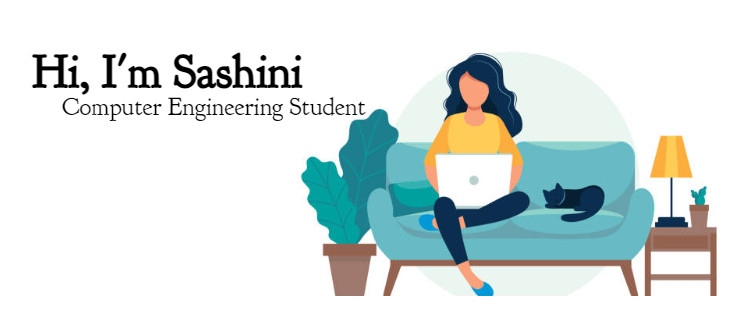

  

 

<!-- 
 

 
 -->

 

  
  
  

<h3 align="center">Computer Engineering undergraduate | University of Peradeniya </h3>

 

  

***About me***

✔ I’m Sashini Liyanage from Kandy, Sri Lanka 
✔ I’m a 3rd year undergraduate from University of Peradeniya 
✔ I’m currently learning Machine Learning 
  

***Skills***

✔ React JS 
✔ JavaScrpit 
✔ HTML 
✔ CSS 
✔ Electron JS 
  

<!-- 
   -->
<!-- 
&nbsp;Git profile Trophies
 
 -->

